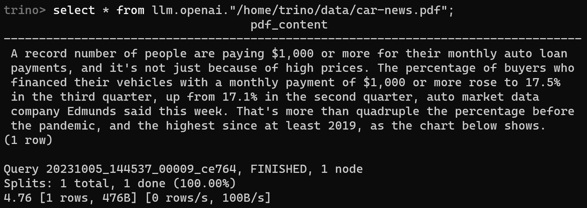

#  trino-llm-plugin
This is a trino plugin that implement offical trino SPI (table functions, functions and connectors) for llvm.

## Features
* Support LLM for automatic datasource selection base on input path in connector
  * achieved by falcon-7b-instruct (chat llm)
* Support LLM question in udf
  * achieved by falcon-7b-instruct (chat llm)
* Support LLM to do sentiment analysis in udf
  * achieved by twitter-roberta (sentiment llm)

With this plugin, user can directly ask ai to read multi-datasources. (in development)

## Requirement
* Java 17 (if java 17 is not locally installed, running mvn install in commandline will give error.)

## Connector Examples
### Read CSV

### Read PDF


## Table Function(UTDF) Examples
### Read CSV

### Read PDF


## Functions(UDF) Examples
### Ask LLM question

### Ask LLM to do sentiment analysis


## Plugin installation
Build project:
```
mvn clean install -DskipTests=true
```
navigate to target folder, unzip file "trino-llvm-1.0-SNAPSHOT.zip", copy files to "trino-llm/docker/plugin/llm". If you have your own trino cluster, copy them to plugin/llm folder

## Trino Cluster in Docker
Navigate to "trino-llm/docker" directory, run following, it will give you a running trino cluster:
```
docker compose up
```

login to container
```
docker exec -it docker-trino-coordinator-1 /bin/bash
```

run trino
```
trino
```