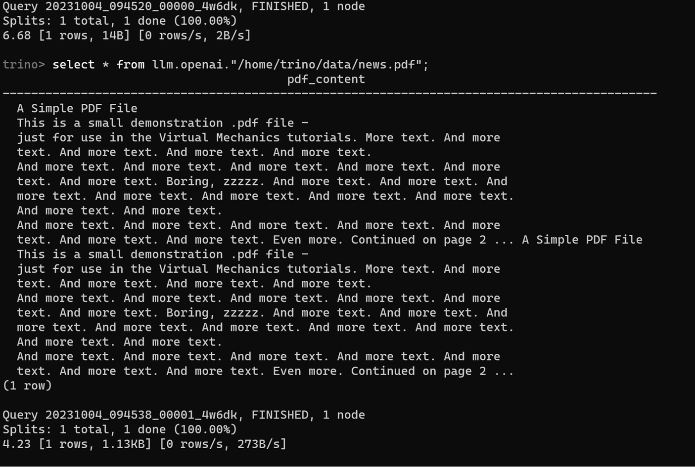

#  trino-llm-plugin
This is a trino plugin that contains table functions and connectors for llvm.

## Features
* automatically detect and connect datasources using LLM 
  * falcon-7b-instruct
  * gpt-3.5-turbo. (in development)

With this plugin, user can directly ask ai to read multi-datasources. (in development)

## Requirement
* Java 17 (if java 17 is not locally installed, running mvn install in commandline will give error.)

## Example screenshot
 


## Read csv from local (Connector)
```
SELECT * 
FROM llm.openai."/trino-llvm/docker/data/users.csv"
```

## Read pdf from local (Connector)
```
SELECT * 
FROM llm.openai."/trino-llvm/docker/data/news.pdf"
```


## Read csv from local (Table function)
```
SELECT * 
FROM TABLE(llm.system.read_file('openai',"/trino-llvm/docker/data/users.csv")
```

## Read pdf from local (Table function)
```
SELECT * 
FROM TABLE(llm.system.read_file('openai',"/trino-llvm/docker/data/news.pdf")
```

## Plugin installation
Build project:
```
mvn clean install -DskipTests=true
```
navigate to target folder, unzip file "trino-llvm-1.0-SNAPSHOT.zip", copy files to "trino-llm/docker/plugin/llm". If you have your own trino cluster, copy them to plugin/llm folder

## Trino Cluster in Docker
Navigate to "trino-llm/docker" directory, run following, it will give you a running trino cluster:
```
docker compose up
```

login to container
```
docker exec -it docker-trino-coordinator-1 /bin/bash
```

run trino
```
trino
```